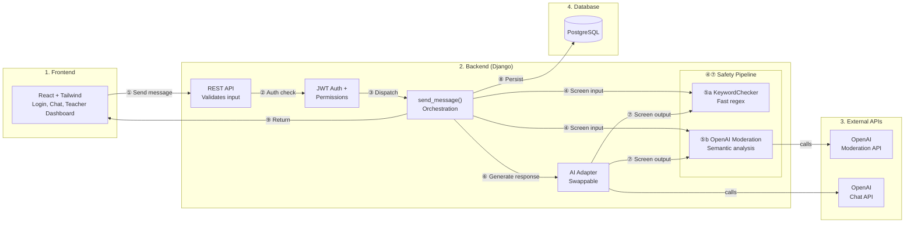
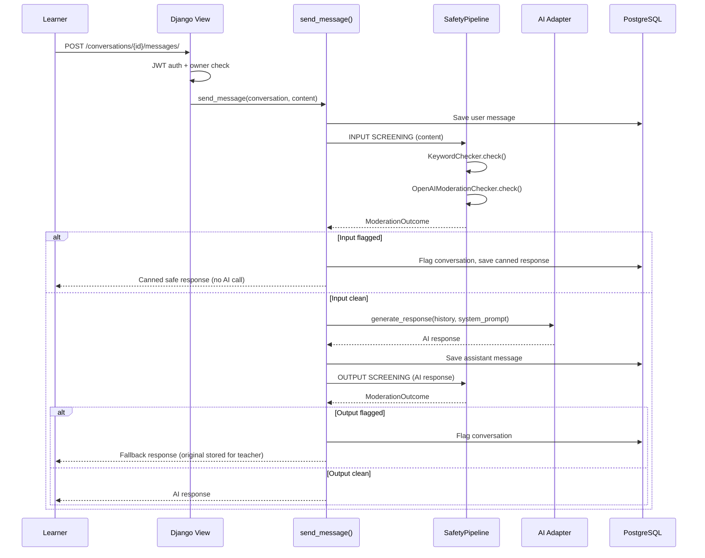
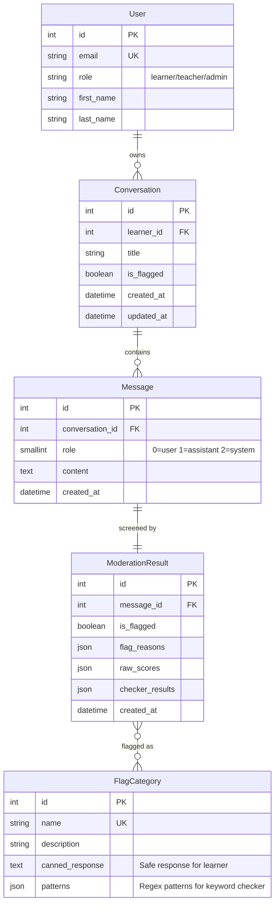

# Architecture

## System Design

The system follows a three-tier architecture: React frontend, Django REST API, PostgreSQL database, with two external integrations (OpenAI Chat API and Moderation API).

A learner signs in, opens a conversation, and sends a message. That message goes through authentication, safety screening, AI generation, and another round of safety screening before a response reaches the learner. Teachers sign in separately and see a dashboard of conversations that were flagged by the safety system.

**Step-by-step:**
1. Learner types a message in the React UI. It's sent as a POST request with a JWT token.
2. Django checks the JWT is valid and the user has the right role (learner, not teacher).
3. The request reaches `send_message()` in `services.py` — the core orchestration function.
4. The message is saved to the database, then passed through the safety pipeline.
5. Two checkers run: (a) KeywordChecker matches regex patterns instantly, (b) OpenAI Moderation API analyzes semantics.
6. If the input is clean, the full conversation history + a structured system prompt are sent to OpenAI Chat API. If flagged, this step is skipped entirely.
7. The AI's response is also screened through the same safety pipeline.
8. Everything is persisted: user message, assistant message, and a ModerationResult for each.
9. The response is returned to the learner. If anything was flagged, the learner sees a safe canned response instead.

## Request Flow (Core: Send Message)

## Data Model

- **User** — learners chat, teachers review flags, admins manage the system. Email is the login identifier.
- **Conversation** — belongs to one learner. `is_flagged` is a one-way flag (once set, stays set for teacher review).
- **Message** — role is stored as an integer (0/1/2) for storage efficiency, mapped back to strings for the API and OpenAI.
- **ModerationResult** — one per message (both user and assistant). Stores which checkers ran, what they found, and the raw scores.
- **FlagCategory** — constrained table of valid categories (self_harm, sexual_content, pii_request, manipulation, harm_content, moderation_unavailable). Seeded via management command. Enforced at the DB level via M2M relationship.

## Key Components

### Safety Pipeline (`safety/checkers/`)
Chain-of-responsibility pattern with two layers:
1. **KeywordChecker** — regex-based, zero latency, zero cost. Catches PII (email, phone, addresses), self-harm keywords, sexual content, and manipulation phrases.
2. **OpenAIModerationChecker** — semantic analysis via OpenAI Moderation API. Catches nuance that keywords miss.

Both layers run on **input AND output**. If any checker flags content, the result is flagged. Each checker's result is logged individually for observability. Checker failures are fail-open (message passes through but is flagged for manual review).

### AI Adapter (`ai/`)
Abstract interface with two implementations:
- **OpenAIAdapter** — real ChatCompletion with retry logic (2 retries on transient errors, no retry on 4xx, 30s timeout)
- **MockAdapter** — deterministic responses for testing

Selected via `AI_ADAPTER` env var. The adapter receives full conversation history + a structured system prompt on each call. Adding a new vendor (Claude, Gemini) means writing one new class — no other code changes.

### Prompt Construction (`ai/prompts.py`)
System prompt is built from structured, named parts: persona, safety rules, and behavioral guidelines. Assembled per-call by `build_system_prompt()` which personalizes with the learner's name. Each part is independently testable and maintainable — changing safety rules doesn't require touching the persona or behavioral guidelines.

### Auth & Permissions (`accounts/`)
- Custom User model extending Django's AbstractUser with a `role` field (learner/teacher/admin)
- JWT authentication via simplejwt (30 min access token, 7 day refresh)
- Two permission classes: `IsLearner` and `IsTeacherOrAdmin`
- Every endpoint enforces role-based access; learners can only access their own conversations

### Orchestration (`conversations/services.py`)
The `send_message` function is the central hub. It coordinates: message persistence → input safety check → AI generation → output safety check → response assembly. All within a database transaction (`@transaction.atomic`) so partial failures don't leave the database in a broken state. Structured logging at each step provides full pipeline visibility.

## Major Tradeoffs

1. **Synchronous AI calls** — The send message endpoint blocks for 1-3 seconds while waiting for OpenAI. Acceptable for a prototype but would need async/task queue for production scale.

2. **Same-vendor screening** — Both chat and moderation use OpenAI. A single-vendor blind spot could miss certain content. Production should use cross-vendor moderation.

3. **Fail-open moderation** — If the OpenAI Moderation API fails, messages pass through (but are flagged for manual review). The keyword checker still runs as first defense.

4. **JWT in localStorage** — Vulnerable to XSS. Production should use httpOnly cookies with CSRF protection.

5. **No rate limiting** — A malicious client could spam the API. Production needs per-user rate limits.

## What I Intentionally Did Not Build

- **Real-time features** (WebSocket/SSE) — Adds Django Channels + Redis complexity for minimal prototype benefit
- **Email verification** — Scope creep for a prototype; would use django-allauth in production
- **Conversation summarization** — For long conversations, would summarize older messages to stay within token limits
- **Admin actions on flagged conversations** — No "dismiss flag" or "block learner" actions; read-only review for now
- **Prompt injection defense** — The system prompt has a soft instruction but no enforced detection in the safety pipeline
- **Audit logging** — Would log all moderation decisions to a separate audit table in production
- **Background processing** — No Celery/Redis; everything is synchronous

## Production Evolution

### General Infrastructure (applies to any web application)

**Deployment:** Start with AWS ECS Fargate — it runs Docker containers without Kubernetes complexity and is practical for a small team . Kubernetes (EKS) makes sense later when you need custom autoscaling metrics, pod disruption budgets, or have multiple teams deploying independently. The Django app runs behind Gunicorn with nginx as reverse proxy. Frontend static build served from a CDN (CloudFront/Cloudflare).

**Scaling:** Horizontal scaling of backend containers behind a load balancer. Auto-scaling policies based on CPU utilization or request latency. Database reads via read replicas for query-heavy endpoints (conversation history, flagged list). PgBouncer for connection pooling — Django opens/closes DB connections per request, which becomes a bottleneck at a lot of requests.

**Caching:** Add Redis (ElastiCache) for caching frequently read data: flagged conversation lists (teacher dashboard), conversation detail, and session storage. Also serves as the backing store for rate limiting.

**Secrets:** AWS Secrets Manager, HashiCorp Vault, or the platform's built-in secrets management. Never in `.env` files or environment variables visible in dashboards. Rotate API keys on a schedule.

**Observability:** Structured JSON logging → CloudWatch or Datadog. Application metrics via Prometheus/Grafana. Error tracking with Sentry. Uptime monitoring on all endpoints.

**Rollback:** Blue-green or canary deployments. Database migrations must be backward-compatible (expand-contract pattern) so rollback doesn't break the schema. Container image versioning with immutable tags.

**CI/CD:** Extend the current GitHub Actions pipeline with deployment stages.

**Cost awareness:** Context windowing (sending fewer tokens) and reserved instances for always-on services are the biggest optimization levers.

### Application-Specific Production Requirements (child-safe AI product)

These are things you would need before going to production specifically because this is a child-facing AI product with conversations and moderation:

**Conversation context management:** Stop sending the full message history to OpenAI on every call. Implement token counting and a sliding window — keep the system prompt + last N messages, or summarize older messages into a condensed context. Without this, long conversations will exceed the model's context window and fail.

**Prompt injection defense:** Add a dedicated safety checker in the pipeline for jailbreak patterns ("ignore previous instructions", "you are now...", "pretend you are..."). The current soft instruction in the system prompt is not sufficient — children will try creative workarounds.

**Cross-vendor moderation:** Use a different AI vendor for output screening (e.g., Anthropic for moderation if OpenAI for chat). This eliminates single-vendor blind spots where the same model that generates harmful content also fails to flag it.

**Background processing for AI calls:** Move AI generation to Celery workers. Start with Redis as the broker (already in the stack for caching). If guaranteed delivery becomes important (no message loss on broker restart), switch to RabbitMQ — it offers durable queues and acknowledgment-based delivery that Redis lacks. Kafka is not appropriate here; it's designed for event streaming and log replay, not task queues. The API returns immediately with a message ID, and the client polls or receives an SSE notification when the response is ready. This prevents request timeouts and allows scaling AI workers independently of API servers.

**Rate limiting per learner:** Children (or bots) could spam messages. Enforce per-user rate limits (e.g., 10 messages per minute) at the API layer using django-ratelimit or at the API gateway level.

**Teacher actions on flagged conversations:** Let teachers dismiss false positives, escalate to admin, add review notes, or temporarily block a learner. The current read-only dashboard is not sufficient for real moderation workflows.

**Immutable audit logging:** Every moderation decision, teacher action, and conversation event should be logged to a separate append-only audit table. This is essential for compliance and incident investigation — you need to prove what happened and when.

**Multi-tenancy:** If the product serves multiple schools or organizations, data should be isolated per tenant at the database level. Options range from a shared database with a `tenant_id` column on every table (simplest), to separate schemas per tenant (Postgres schemas), to fully separate databases per tenant (strongest isolation, highest ops cost). For a child-safety product where schools may have compliance requirements around data access, schema-level or database-level isolation is likely required.

### Compliance Considerations

Key regulations for a child-facing AI product: **COPPA** (US, parental consent for children under 13), **GDPR/UK Age Appropriate Design Code** (data protection impact assessments, privacy by default), **FERPA** (if used in schools, student records are protected), and the **EU AI Act** (classifies child-facing AI as high-risk, requires transparency that the child is talking to an AI).

Practical steps before production: parental consent flow, data retention policies with auto-deletion, right-to-deletion support, Data Processing Agreements with OpenAI, labeling AI responses as AI-generated, and an incident response plan for when harmful content bypasses safety checks.

## What I Would Improve First (One More Week)

1. **Prompt injection defense** — Add a dedicated safety checker for jailbreak patterns in the pipeline
2. **Conversation context windowing** — Token counting + sliding window to prevent context overflow
3. **Rate limiting** — Per-user limits to prevent abuse
4. **Cross-vendor moderation** — Use a different provider for output screening
5. **Admin actions** — Let teachers dismiss flags, escalate, or block learners
